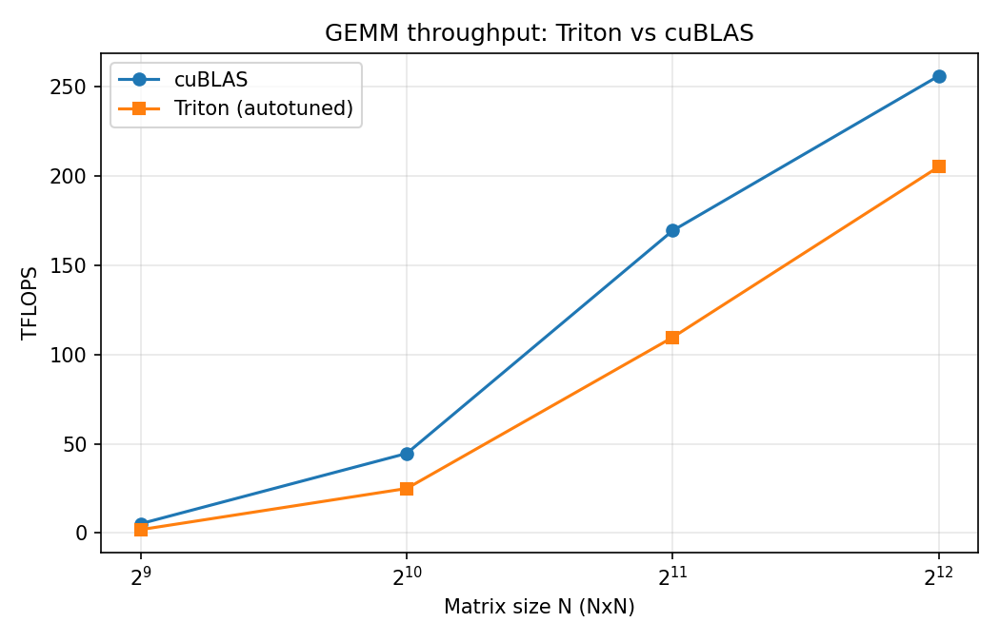
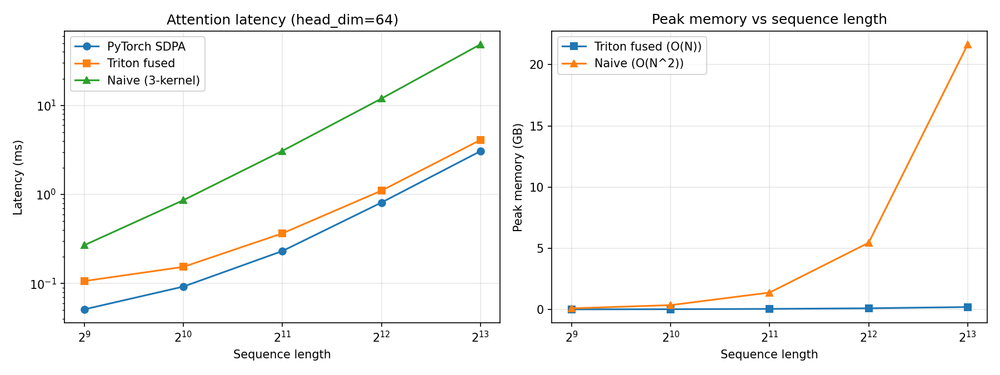
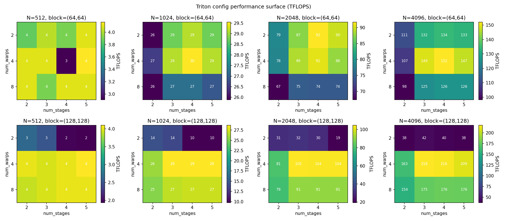

# Triton Kernel Comparison

Hand-tuned CUDA kernels ported to Triton, with a systematic characterization
of Triton's autotuner against manual pipeline scheduling.

**Key finding:** The autotuner consistently diverges from hand-tuned pipeline
depths — at N=4096 it selects 3 stages (vs hand-tuned 4), and at N=512 it
selects 5 stages (vs hand-tuned 3). Despite this, the autotuner's best config
reaches **217.89 TFLOPS** at N=4096, achieving **80.1%** of cuBLAS throughput.

## Layout

```
kernels/                    Triton kernel implementations
  matmul_triton.py          autotuned GEMM + fixed-config variant for sweeps
  attention_triton.py       fused attention w/ online softmax + causal masking
bench/                      benchmarking harness
  utils.py                  CUDA-event timing, error metrics, TFLOPS math
  bench_gemm.py             Triton vs cuBLAS (+ CUDA WMMA if available)
  bench_attention.py        Triton vs SDPA vs naive; latency + peak-memory grid
analysis/                   performance analysis
  autotuner_sweep.py        full (size x config) sweep -> performance surface
  extract_ptx.py            Triton PTX dump + instruction-count stats
  plots.py                  performance-surface heatmaps + comparison charts
  torch_compile_check.py    custom ops, graph-break check, vs Inductor
results/
  data/                     CSVs from every run
  ptx/                      dumped PTX/SASS
  charts/                   PNGs referenced below
```

## Running

Everything runs from the repo root as modules, on Colab (Pro, A100/H100) or
any CUDA box:

```bash
python -m bench.bench_gemm
python -m bench.bench_attention
python -m analysis.autotuner_sweep
python -m analysis.extract_ptx
python -m analysis.plots
python -m analysis.torch_compile_check
```

**Hardware note:** benchmark numbers in `results/data/` are tagged with the
device via `device_report()`. Cross-hardware comparisons are only valid on
matching hardware (A100 / sm_80).

## GEMM Results

Triton autotuned GEMM vs cuBLAS across matrix sizes:

| N    | cuBLAS (TFLOPS) | Triton (TFLOPS) | Triton / cuBLAS |
|------|-----------------|-----------------|-----------------|
| 512  | 5.24            | 1.90            | 36.2%           |
| 1024 | 44.62           | 24.97           | 56.0%           |
| 2048 | 169.47          | 109.66          | 64.7%           |
| 4096 | 256.14          | 205.23          | 80.1%           |

Triton's gap narrows significantly at larger sizes where the kernel is
compute-bound and launch overhead is amortized.



## Attention Results

Triton fused attention (online softmax, O(N) memory) vs PyTorch SDPA vs
naive 3-kernel attention (O(N^2) memory), at head_dim=64, non-causal:

| Seq   | SDPA (ms) | Triton (ms) | Naive (ms) | Triton TFLOPS | Triton Peak (GB) | Naive Peak (GB) |
|-------|-----------|-------------|------------|---------------|-------------------|-----------------|
| 512   | 0.051     | 0.107       | 0.269      | 20.16         | 0.021             | 0.103           |
| 1024  | 0.092     | 0.154       | 0.862      | 55.92         | 0.034             | 0.365           |
| 2048  | 0.231     | 0.366       | 3.088      | 93.99         | 0.059             | 1.393           |
| 4096  | 0.811     | 1.104       | 11.938     | 124.51        | 0.109             | 5.461           |
| 8192  | 3.064     | 4.094       | 48.566     | 134.28        | 0.210             | 21.651          |

At seq=8192, Triton fused attention uses **~100x less memory** than the naive
implementation (0.21 GB vs 21.65 GB) and is **~12x faster** (4.09 ms vs
48.57 ms). Triton reaches 67-75% of PyTorch SDPA latency at longer sequences.



## Autotuner Sweep

The sweep (`analysis/autotuner_sweep.py`) exhaustively times the full config
space (num_stages x num_warps x block shapes) at each matrix size, producing
the performance surface below.

### Autotuner choices vs hand-tuned pipeline depth

| N    | Block Shape  | Warps | Autotuner Stages | Hand-Tuned Stages | Match |
|------|-------------|-------|------------------|-------------------|-------|
| 512  | (64,64,32)  | 4     | 5                | 3                 | No    |
| 1024 | (64,64,32)  | 4     | 4                | 3                 | No    |
| 2048 | (64,128,32) | 4     | 4                | 3                 | No    |
| 4096 | (128,128,64)| 4     | 3                | 4                 | No    |

The autotuner never matched the hand-tuned stage count, though it
independently converges on 4 warps at every size.

### Performance surface



## Findings

1. **Warp count dominates block shape selection.** At block=(128,128) with 2
   warps, throughput collapses (38 TFLOPS at N=4096 vs 218 TFLOPS with 4
   warps). Insufficient warps leave pipeline stages idle. With the smaller
   block=(64,64), the effect is less dramatic since each tile needs fewer
   warps.

2. **Stage count has diminishing returns past 3.** At N=4096 with 4 warps and
   block=(128,128), stages 3/4/5 deliver 218/216/209 TFLOPS respectively.
   The autotuner correctly identifies 3 stages as optimal here, while the
   hand-tuned CUDA kernel used 4 stages for the same size.

3. **Small matrices are launch-overhead dominated.** At N=512, the entire
   config space is within ~4 TFLOPS regardless of configuration. The kernel
   is too short for pipeline depth or warp count to differentiate meaningfully,
   and Triton reaches only 36% of cuBLAS (which benefits from highly optimized
   small-matrix dispatch).

4. **Autotuner and manual tuning optimize different axes.** The autotuner
   explores block shapes and warp counts jointly (selecting 128x128 blocks
   with 4 warps at N=4096), while manual tuning focused primarily on pipeline
   depth. The autotuner's holistic search finds configs the manual approach
   would not explore, but its stage choices consistently differ from
   hand-tuned values.

## Profiling Note

Nsight Compute (`ncu`) requires GPU performance-counter permissions that Colab
VMs typically block. `ncu` profiling runs on a dedicated A100 instance;
everything else in this repo runs on Colab.
